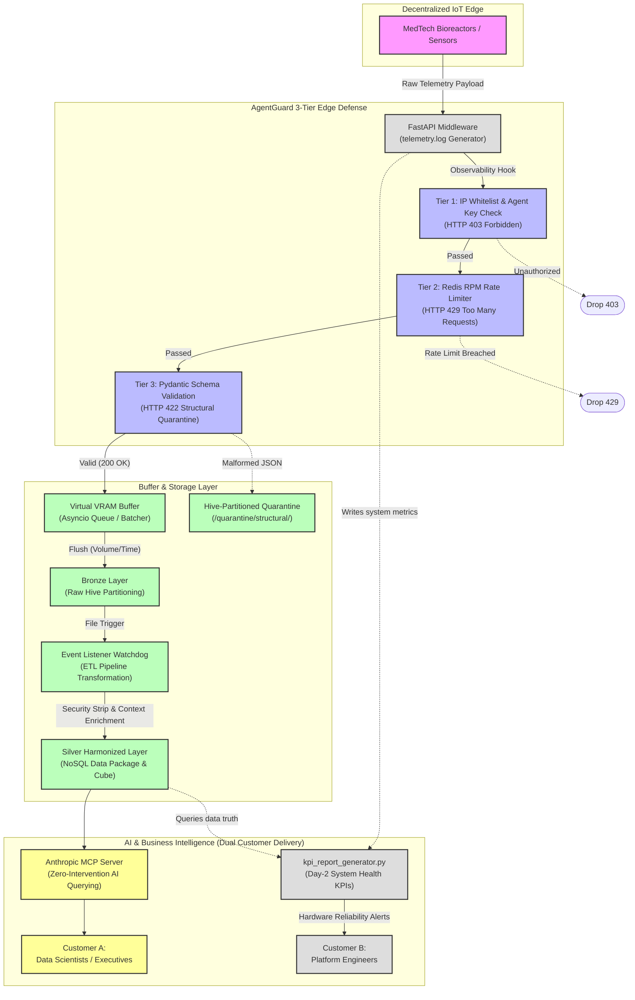

# AgentGuard: Enterprise IoT Edge Governance & Data Pipeline

## Executive Summary & Core Use Case

AgentGuard is an end-to-end edge governance proxy and Medallion data pipeline built for high-throughput MedTech IoT environments.

**The Business Problem:** In decentralized manufacturing (e.g., autonomous bioreactors producing synthetic insulin), if a physical sensor's firmware crashes and gets stuck in a retry loop, it can flood the network with malformed, high-velocity payloads. Without strict edge governance, this "Shadow IoT" traffic triggers expensive downstream cloud ETL jobs, exhausts storage I/O, and permanently poisons the central scientific data lakehouse.

**The Solution:** AgentGuard acts as the strict "air-traffic control tower" at the extreme edge. It authenticates physical equipment, enforces Requests-Per-Minute (RPM) volumetric quotas to prevent internal infrastructure DDoS attacks, quarantines structurally malformed telemetry to protect data pipelines, buffers hardware traffic spikes in volatile RAM, and perfectly standardizes clean data via Hive partitioning for programmatic BI and external interoperability.

---

## System Architecture & End-to-End Data Flow

## Pipeline Orchestration

This micro-emulator maps localized Python components directly to enterprise-grade cloud paradigms (e.g., AWS API Gateway, ElastiCache, Kafka, S3 Event Notifications).

1. **Edge Ingestion & Observability (FastAPI + Redis):** Intercepts all equipment payloads via a dedicated API middleware that generates structured JSON telemetry logs. Authenticates endpoints and enforces strict volumetric RPM quotas.
2. **Backpressure Buffer (Asyncio VRAM):** Surviving 200 OK traffic is asynchronously buffered in volatile memory and dynamically flushed to disk based on volume or time thresholds, preventing storage I/O locks during concurrent factory data uploads.
3. **Event-Driven ETL (Watchdog OS Listener):** The exact millisecond VRAM flushes approved data into the Hive-partitioned Bronze storage layer, a localized event listener triggers the transformation pipeline, validating the schema and appending immutable chain-of-custody metadata.
4. **Programmatic BI & Interoperability (NoSQL + MCP):** Clean data is harmonized into a deeply nested Silver directory. A localized BI script queries system health KPIs (e.g., 429 Hard Drop Rates), and an Anthropic Model Context Protocol (MCP) adapter exposes the FAIR-compliant scientific data for secure external querying.

---

## The 3-Tier Edge Defense (Hardware Remediation)

AgentGuard is explicitly designed to catch physical hardware failures before they reach the cloud computing layer, routing telemetry based on strict API contracts.

* **1. Security (Unauthorized Equipment):** Unregistered devices missing whitelist authorization instantly trigger a **`403 Forbidden`** Hard Drop. Connection severed.
* **2. Reliability (Hyperactive Firmware):** Broken sensors stuck in a spam loop that exceed their baseline RPM quota trigger a **`429 Too Many Requests`** Hard Drop, protecting downstream compute and memory.
* **3. Integrity (Malformed Telemetry):** Sensors reporting structurally broken payloads (e.g., sending text strings instead of floats, or missing critical fields) fail strict Pydantic validation, triggering a **`422 Unprocessable Entity`**. They are diverted directly to local disk at **`/quarantine/structural/year=YYYY/month=MM/day=DD/`** to preserve raw observations for physical engineering review without poisoning the clean lakehouse.

---

## Proving the Architecture (Chaos Engineering & SLOs)

To mathematically prove the integrity of the architecture, this repository includes a custom high-throughput, asynchronous stress-testing tool (`load_tester.py`) designed to violently test architectural constraints.

* **Volumetric Protection:** The system executes 429 Hard Drops the exact millisecond a sensor breaches its configured RPM limit.
* **System Latency:** The strict platform SLO mandates that Gateway interception, observability logging, quota tracking, and schema validation must execute with **< 50ms overhead per request**.
* **Data Truth Integrity:** The VRAM buffer successfully absorbs `200 OK` traffic spikes and flushes to disk dynamically, guaranteeing zero data loss during high-concurrency factory uploads.

