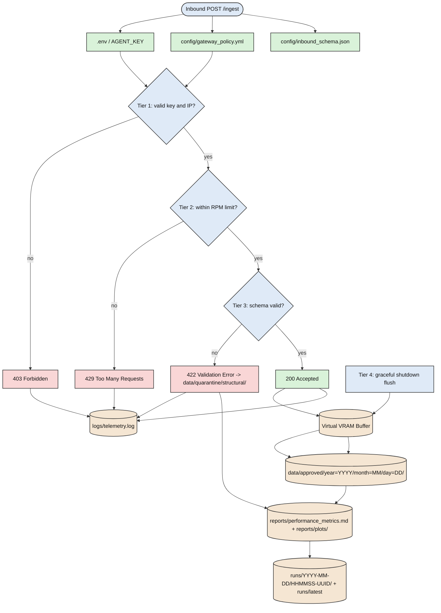

# AgentGuard Architecture

## 1. System purpose

This repository implements a compact edge-gateway runtime for IoT telemetry. It receives payloads from device or test clients, authenticates them, enforces per-equipment request limits, validates payload structure against the repo schema contract, quarantines malformed data, and flushes approved payloads through a memory buffer to partitioned disk storage.

The runtime is intentionally small and explicit:

- [src/gateway.py](../src/gateway.py) hosts the FastAPI application and request lifecycle
- [src/redis_mock.py](../src/redis_mock.py) enforces the in-memory RPM gate
- [src/virtual_vram_batcher.py](../src/virtual_vram_batcher.py) batches approved payloads before disk persistence
- [config/gateway_policy.yml](../config/gateway_policy.yml) defines the policy posture
- [config/inbound_schema.json](../config/inbound_schema.json) is the strict payload contract
- [logs/](../logs/) records middleware telemetry
- [data/](../data/) stores approved and quarantined output partitions
- [reports/](../reports/) stores metrics and plots
- [runs/](../runs/) stores execution snapshots and the latest symlink

## 2. Runtime responsibilities

### 2.1 Security and routing

The gateway enforces a four-tier flow:

1. Tier 1: validate the client IP and agent key
2. Tier 2: enforce the per-equipment RPM limit
3. Tier 3: validate the payload against the schema contract in [config/inbound_schema.json](../config/inbound_schema.json)
4. Tier 4: on shutdown, flush any remaining approved payloads from VRAM before exit

This means the gateway performs authentication and rate-limit enforcement as a hard gate, while schema mismatches are preserved in quarantine rather than silently ignored.

### 2.2 Result semantics

- 403 Forbidden: invalid agent key or disallowed source IP
- 429 Too Many Requests: the equipment exceeded its configured RPM window
- 422 Validation Error: payload failed the schema contract and was written to quarantine
- 200 OK: payload was accepted and queued into the volatile VRAM buffer

### 2.3 Graceful shutdown

The shutdown path is not a re-run of Tier 1, 2, or 3. It is a lifecycle durability step. Once the process is terminating, the gateway drains the approved queue from the in-memory VRAM buffer and writes the remaining approved payloads to disk before exit.

## 3. Request lifecycle

## 4. Operational artifact boundaries

The repo is designed around clear input and output boundaries:

- Inputs:
  - [config/gateway_policy.yml](../config/gateway_policy.yml)
  - [config/inbound_schema.json](../config/inbound_schema.json)
  - [.env](../.env)
  - runtime traffic sent to the FastAPI /ingest endpoint

- Operational outputs:
  - [logs/](../logs/) for telemetry and buffer flush logs
  - [data/approved/](../data/approved/) for accepted payloads
  - [data/quarantine/structural/](../data/quarantine/structural/) for malformed payloads
  - [reports/](../reports/) for markdown summaries and plots
  - [runs/](../runs/) for execution snapshots and latest symlink

## 5. Architectural summary

The design is intentionally explicit and auditable:

- authentication is a hard gate
- rate-limiting is a hard gate
- schema validation preserves malformed data in quarantine
- approved data is buffered in memory and then written to partitioned disk storage
- operator reporting and execution snapshots are produced from the persisted data and runtime logs

This keeps the implementation aligned with the actual runtime behavior, the runbook diagrams, and the repo’s file layout.
