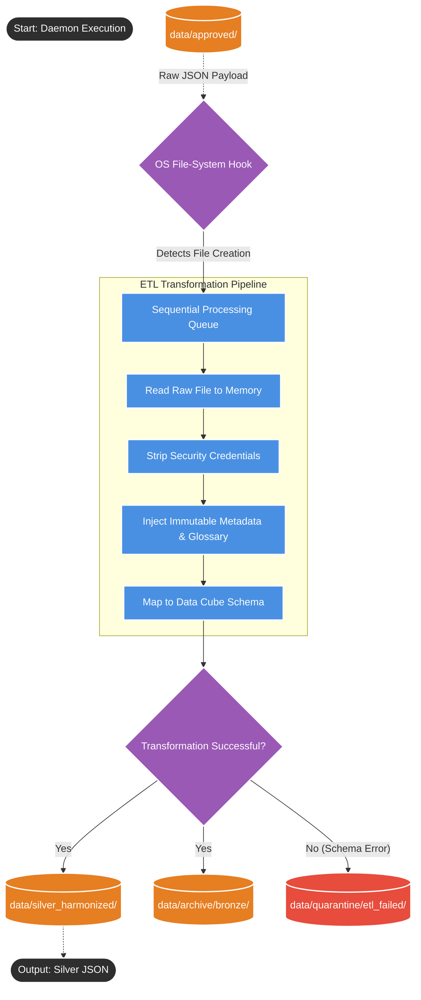
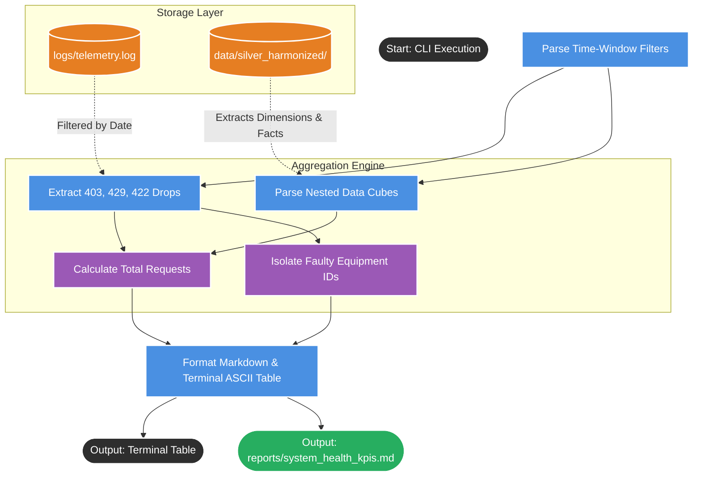

# Event Listener

## 1. System Mental Model (The Flowchart)

This script emulates cloud-native event triggers (like AWS S3 Event Notifications) using local operating system hooks. It bridges the Bronze raw storage layer to the Silver harmonized lakehouse by acting as an automated, event-driven Extract, Transform, and Load (ETL) pipeline.

## 2. The Operating Manual

To operate this tool, it is run as a background daemon (or managed by `system_orchestrator.py`). It does not require continuous CLI inputs, as it relies on strict infrastructural pathing.

* **Execution Command:** `python src/event_listener.py`.

* **Trigger Mechanism:** Instead of using an infinite `while True` polling loop that drains CPU, the script uses the Python `watchdog` library to hook directly into the Operating System. The exact millisecond the OS registers a file write in `data/approved/`, the script wakes up.

* **The Target Directory:** It strictly monitors `data/approved/`.

* **The Transformation Rules:**
* *Security:* Permanently strips the temporary `agent_key` from the payload.

* *Compliance:* Appends an immutable **Chain of Custody** (processing timestamp, edge ingestion time, gateway compute node ID).

* *Structure:* Maps flat telemetry into a nested **Data Cube**, separating metadata Dimensions from physical measurement Facts.

## 3. Outputs & Side Effects

When the watchdog successfully intercepts and processes a payload, it produces the following physical state changes on the hard drive:

* **The Silver Payload (Creation):** It writes the deeply nested, FDA-compliant JSON document directly into the `data/silver_harmonized/` NoSQL directory structure. This file is now ready for Business Intelligence (BI) and AI querying.

* **The Bronze Archive (Move):** To prevent the watchdog from infinitely re-processing the same file, the original raw JSON is physically moved from `data/approved/` to `data/archive/bronze/`.
* **The ETL Quarantine (Move):** If the Python transformation logic crashes (e.g., a missing key causes a `KeyError`), the raw file is moved to `data/quarantine/etl_failed/`. This ensures the single bad file does not crash the entire daemon and allows data engineers to investigate the failure.

## 4. TPM Risk Areas

If I were reviewing this architecture for a production-grade testing pipeline, here are the two bottlenecks I would ask the engineering team to address immediately:

* **File Locking / Concurrency during Read/Write:** If the watchdog script attempts to read the file the exact millisecond the upstream VRAM buffer is still writing it, Python will throw a `PermissionError` or process a partially written file. The engineering team must implement a read-retry loop or an atomic write mechanism (e.g., writing the file to a `.tmp` extension first, then renaming it to `.json` so the watchdog only reacts to complete files).

* **Idempotency & Zombie Retries:** If the `event_listener.py` process crashes or is killed by the OS *after* it writes the Silver file but *before* it moves the Bronze file to the archive, the system will re-process that exact same file upon reboot. The script must check if a Silver file with that specific `_request_id` already exists before executing the transformation to ensure strict idempotency.

# KPI Report Generator.

## 1. System Mental Model (The Flowchart)

This script serves **Customer B: The Platform Owner**. It is a read-only Business Intelligence (BI) tool that synthesizes disparate data sources (raw application logs and structured NoSQL Data Cubes) into a unified, actionable assessment of hardware health on the factory floor.

## 2. The Operating Manual

Because this is an on-demand reporting tool run by Business Analysts and Platform Engineers, it accepts dynamic arguments to focus the report on specific operational windows.

* **Execution Command:** `python src/kpi_report_generator.py`.

* **--days**: The time boundary filtering how far back the script should look for data.
* *Default*: 7

* **--log-path**: The path to the edge telemetry logs.
* *Default*: `logs/telemetry.log`

* **--silver-dir**: The path to the harmonized NoSQL database.
* *Default*: `data/silver_harmonized/`

* **--output**: The destination for the persistent markdown artifact.
* *Default*: `reports/system_health_kpis.md`

## 3. Outputs & Side Effects

This script is completely read-only. It does not mutate or delete any production data. When executed, it produces two specific deliverables:

* **The Terminal Audit (Primary AC):** It prints a highly structured, clean ASCII table directly to the terminal. This table aggregates the total requests processed and explicitly identifies which specific physical bioreactors (`equipment_id`) require emergency hardware repair based on their specific 403, 429, and 422 drop counts.

* **The Persistent Markdown Report:** It saves an executive summary to `reports/system_health_kpis.md`. This allows stakeholders to review the metrics without needing to boot up the `system_orchestrator.py` environment or run terminal commands.

* **System Side Effects:** None. It performs a non-destructive read of the local directories.

## 4. TPM Risk Areas

If I were reviewing this BI architecture for deployment into a production enterprise environment, I would raise two specific integration risks:

* **Pipeline Lag (Data Desync):** The script reconciles the total inputs by adding the Drops (from the logs) to the Successes (from the Silver layer). However, if the `event_listener.py` watchdog is backlogged and taking 5 minutes to transform the Bronze files into Silver files, the KPI script will report "missing data" because the logs recorded the ingestion instantly, but the Silver layer hasn't received the file yet. The script should explicitly warn the analyst if Bronze files are currently waiting in the queue.
* **Nested Parsing Brittleness:** The script is required to parse deeply nested JSON structures (Data Cubes) and separate Dimensions from Facts. If the upstream ETL pipeline accidentally changes the key from `data_cube` to `datacube` in a future release, this KPI script will throw a `KeyError` and crash. The script must utilize safe dictionary `.get()` methods with fallback defaults when querying the NoSQL files.

