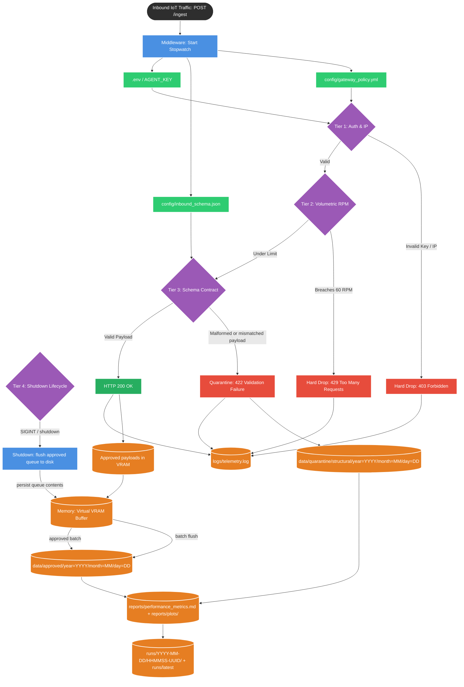
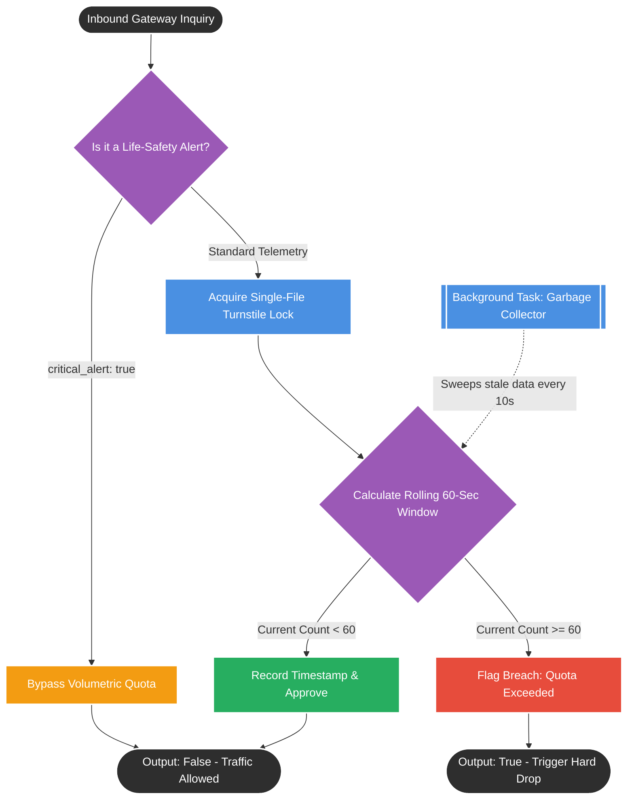
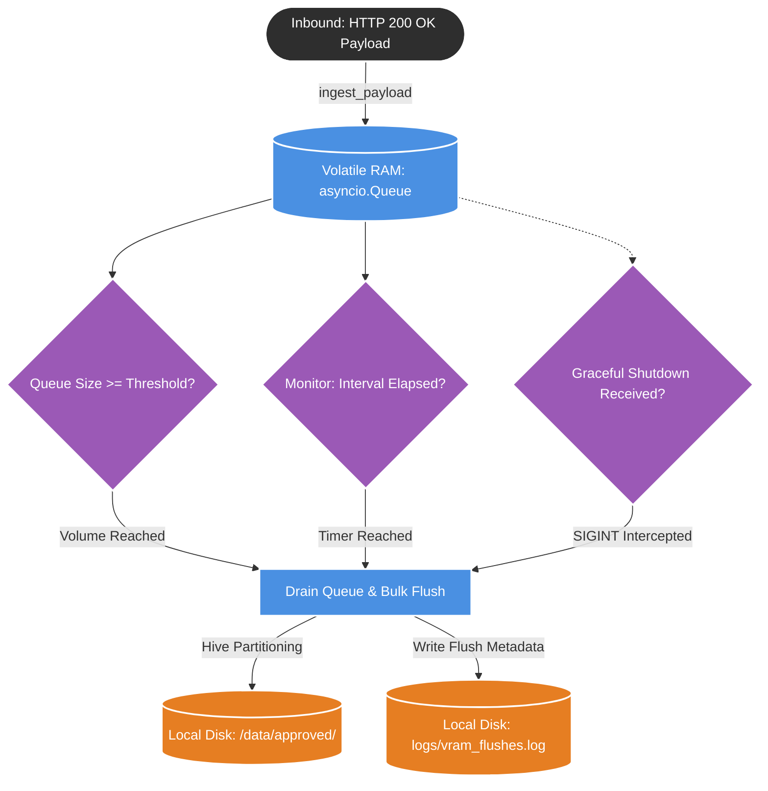

# Gateway.py

This code represents the fully realized **API Interception Proxy**, successfully implementing the 3-Tier Edge Defense and addressing the telemetry directory routing bug we discussed previously.

## 1. System Mental Model (The Flowchart)

This flowchart shows the real lifecycle of the gateway: the request is checked in three security tiers, and the shutdown path is a separate lifecycle step that flushes only approved in-memory payloads.

---

## 2. The Operating Manual

To operate this API Gateway, it must be run via an ASGI server (like Uvicorn or the `system_orchestrator.py` bootstrapper). It acts as a passive listener. The request path is best understood as a four-stage model:

* **Tier 1 — Authentication & Network Entry**: The request must originate from an approved local network IP (`127.0.0.1`, `::1`, or `localhost`) and include a valid `x-agent-key` header or `agent_key` query parameter. Invalid values trigger a hard 403 response.
* **Tier 2 — Volumetric Enforcement**: The gateway checks the per-`equipment_id` RPM counters through the Redis-mock. If the threshold is crossed, it returns a hard 429 response.
* **Tier 3 — Schema Contract Enforcement**: The payload must conform to the strict structure defined in `config/inbound_schema.json`. If it is malformed or mismatched, it is quarantined and returns a 422 response. This is not a network-level hard drop; it is a data-preservation path.
* **Tier 4 — Graceful Shutdown Lifecycle**: After a request has already been accepted, shutdown handling drains any remaining approved payloads from VRAM to disk. This is a lifecycle durability step, not a request re-check.

The payload itself is expected to be a JSON object with the following top-level fields:
* `equipment_id`: A string identifying the sensor.
* `payload`: A nested dictionary containing the actual sensor readings.
* `agent_key`: The runtime key value read from the environment file.
* `timestamp`, `critical_alert`, and `telemetry`: The schema-required fields enforced by the contract.

---

## 3. Outputs & Side Effects

When traffic flows through this gateway, it produces four distinct side effects based on the strict architectural rules we established:

* **Configuration Inputs**: The gateway reads operational settings from `config/gateway_policy.yml`, the validation schema from `config/inbound_schema.json`, and the active local credential set from `.env`.
* **System Observability (Metadata)**: The gateway generates a `logs/telemetry.log` file tracking request latency and HTTP status codes for each request. This becomes part of the operational audit trail.
* **Quarantine Routing (Broken Data)**: If a payload fails structural validation (422), the gateway preserves the raw JSON on disk at `data/quarantine/structural/year=YYYY/month=MM/day=DD/` for review, root-cause analysis, and hardware triage. This is a validation/quarantine path, not a hard network drop.
* **VRAM Buffering (Clean Data)**: If the payload receives a 200 OK, the gateway hands it off to the asynchronous `VramBuffer` in active volatile memory for batching and staged disk flushes into `data/approved/year=YYYY/month=MM/day=DD/`.
* **Report & Run Artifacts**: Operational reports are generated under `reports/` (including `performance_metrics.md` and `plots/`), while historical execution snapshots are organized under `runs/YYYY-MM-DD/HHMMSS-UUID/` and exposed via `runs/latest`.
* **Graceful Shutdown (Lifecycle Integrity)**: If the server process is terminated, the gateway executes its lifespan shutdown logic and flushes any remaining approved payloads from VRAM to disk before exit. This is not a re-check of Tier 1/2/3; it is the final durability step for already-approved traffic.

---

## 4. TPM Risk Areas

If we were preparing to deploy this gateway code to a production environment, I would highlight the following risks for the engineering team:

* **Security Configuration Lock-in**: The repository already contains a `.env` file at the project root, but the runtime must read it dynamically; otherwise the app continues to rely on hardcoded keys or stale import-time values. The gateway should resolve the auth set from the environment at startup and use the live value during request checks.
* **Schema Contract Drift**: The active request model in `src/gateway.py` is `IngestRequest` with `payload: dict[str, Any]`, while the stricter design contract lives in `config/inbound_schema.json`. The runtime should enforce the schema file directly so every accepted request matches the enterprise contract and invalid payloads are consistently redirected to quarantine.
* **Lifecycle-Only Flush Misinterpretation**: Graceful shutdown is not a security tier. It applies only to payloads that have already passed Tier 1 through Tier 3 and are waiting in VRAM. If the queue is oversized or the process exits before flush, the buffer can still lose approved data unless the shutdown drain is synchronized correctly.
* **False-Positive 200 OKs (The Fire-and-Forget Risk)**: The gateway currently sends the HTTP 200 OK response to the sensor *before* the payload is fully safely accepted by the VRAM buffer. It wraps the VRAM ingestion in a background `asyncio.create_task`. If the VRAM buffer's queue is completely locked, or if that background task throws an unhandled exception, the payload is silently lost in memory—but the MedTech sensor will think it was successfully saved because it already received the 200 OK.

# redis_mock.py

Acting as our "Enterprise Distributed Cache Simulator", this component functions as the high-speed state tracker for our API Gateway. It serves as a highly specialized calculator that monitors incoming traffic volumes and flags quota breaches, though it leaves the actual connection-dropping enforcement up to the gateway itself.

## 1. System Mental Model (The Flowchart)

This flowchart visualizes the exact decision tree every incoming payload traverses to determine if a sensor is behaving normally or executing an infrastructure DDoS attack.

---

## 2. The Operating Manual

This is an internal class initialized directly by the API Gateway. It accurately tracks Volumetric RPM isolated by unique `equipment_id`. Here are its configuration and runtime inputs:

* **Configuration Thresholds (Initialization):**
* **Time Window (`window_seconds`):** The rolling timeframe used to calculate the traffic rate.
* *Default:* `60` seconds.

* **Volumetric Quota (`max_requests`):** The absolute maximum number of payloads a specific hardware device is allowed to send within the time window.
* *Default:* `60` requests.

* **Sweep Frequency (`gc_interval_seconds`):** How often the background cleanup loop wakes up to delete expired data.
* *Default:* `10.0` seconds.

* **Runtime Inputs (Per-Request):**
* **Equipment ID:** The unique identifier of the sensor sending the data.
* **Payload Dictionary:** The actual JSON body from the sensor. This is inspected strictly to see if payloads containing `critical_alert: true` must bypass the counter logic and never be flagged for a breach.

---

## 3. Outputs & Side Effects

This module acts strictly as a tracking calculator, producing the following outcomes:

* **The Validation Signal (Boolean Output):** It returns a simple `True` (the limit is breached) or `False` (the traffic is safely under the limit). The Redis-mock acts as the calculator that tracks the state and flags the breach, but the API gateway acts as the enforcer that actually terminates the connection and issues the HTTP 429 Hard Drop back to the client.
* **State Mutation (Side Effect):** State mutations must be strictly protected by an asyncio concurrency lock to simulate enterprise cache integrity during a concurrent traffic spike. Once the lock is acquired, the system logs the exact millisecond of the request into active volatile RAM.
* **Memory Leak Prevention (Side Effect):** The service must implement a memory cleanup protocol to clear stale in-memory data once the 60-second window expires. A background task perpetually runs to delete empty equipment lists, ensuring the server does not run out of memory over days of continuous operation.

---

## 4. TPM Risk Areas

If we were migrating this component toward a Production environment, I would raise the following architectural risks to the engineering team:

* **The Horizontal Scaling Failure (Concurrency Limitation):** This code relies on a local concurrency lock. If an enterprise scales horizontally by deploying 5 gateway servers behind a load balancer, this local lock fails because it only works inside the memory of a single server. The servers will be completely blind to each other's whiteboards, re-introducing race conditions during a traffic spike. We would need a centralized, single-threaded distributed database (like a true Redis cluster) to act as a universal lock across the entire cloud network.
* **Unbounded Key Growth (DDoS Vector):** The internal tracking dictionary isolates memory by `equipment_id`. If a malicious actor bypasses our IP whitelist and fires 5 million payloads—*each with a completely random, fake equipment ID*—this tracker will create 5 million isolated lists in RAM before the 10-second Garbage Collector can wake up to clear them. This could easily trigger an Out-of-Memory (OOM) crash.

# Virtual_vram_batcher

This code represents the Virtual VRAM Buffer, which serves as the primary backpressure mechanism for your architecture. By buffering 200 OK traffic in volatile memory and dynamically flushing it via Hive Partitioning, it explicitly protects downstream storage I/O from being exhausted by concurrent physical factory uploads.

### 1. System Mental Model (The Flowchart)

This flowchart visualizes how the asynchronous memory queue holds validated data in active memory until a specific enterprise trigger forces a physical write to the hard drive.

---

### 2. The Operating Manual

This module is not a standalone executable script; it is a core microservice initialized and managed by the API Gateway or your master `system_orchestrator.py` bootstrapper.

To configure and operate this buffer, the following constraints and inputs apply:

* **`flush_threshold` (Volumetric Trigger)**: The absolute maximum number of payloads the volatile queue will hold before autonomously triggering a bulk flush to the local disk.
* *Default*: `500` payloads.

* **`flush_interval` (Temporal Trigger)**: A continuous background monitor that forces a bulk flush of any unwritten payloads after a specific amount of time has elapsed, preventing data staleness.
* *Default*: `10.0` seconds.

* **`storage_root` & `output_dir_name**`: The root destination for the written data.
* *Default*: Resolves to your project's `/data/approved/` directory.

* **Lifecycle Methods**:
* `start()`: Must be called to boot up the background 10-second temporal monitor.
* `ingest_payload()`: The entry point utilized by the Gateway. The queue must strictly ingest *only* payloads that successfully received an HTTP 200 OK status.
* `shutdown()`: The graceful shutdown handler that intercepts OS termination signals (like SIGINT/Ctrl+C), blocks immediate termination, and flushes all remaining payloads to disk before allowing the server process to exit to guarantee zero data loss.

---

### 3. Outputs & Side Effects

When one of the three enterprise triggers (Volumetric, Temporal, or Shutdown) forces a flush, the buffer produces two distinct artifacts:

* **Hive-Partitioned Storage Routing (The Data):** The buffer dynamically creates a deeply nested directory structure on the local disk strictly following Hive partitioning rules (e.g., `/approved/year=YYYY/month=MM/day=DD/`). It aggregates all payloads currently in the queue and saves them as a single `.json` file stamped with the exact microsecond and a unique UUID to prevent overwrites.
* **Flush Metadata Logging (The Audit Trail):** It acts as an internal observable system by appending a ledger entry to a localized `logs/vram_flushes.log` file. This log includes the exact timestamp of the flush, the destination file path, the total count of payloads in that batch, and a sampling of up to 10 `_request_id`s for downstream pipeline reconciliation.

---

### 4. TPM Risk Areas

If we were preparing this architectural component for a production-grade deployment, I would raise the following two major risk areas to the engineering team:

* **Synchronous I/O Blocking the Async Loop:** The `_flush_to_disk()` method is defined as an `async def`, but it uses synchronous standard library calls (`partition_dir.mkdir()` and `destination.write_text()`). Because disk writing is a blocking operation, writing a massive multi-megabyte JSON file during a heavy traffic spike will physically freeze the FastAPI server's main event loop for several milliseconds. The team should update this to use non-blocking asynchronous file I/O libraries (like `aiofiles`) or push the write operation to a separate thread (`asyncio.to_thread()`).
* **Silent Failures in the Audit Trail:** In the `_flush_to_disk()` method, the code that writes to the `vram_flushes.log` file is wrapped in a broad `try / except Exception: pass` block. If the system experiences a permission error or a locked file state while trying to write the log, the error is swallowed entirely. The flush will succeed, but the system will silently fail to log it, destroying the audit trail and leaving platform engineers completely blind to the failure.