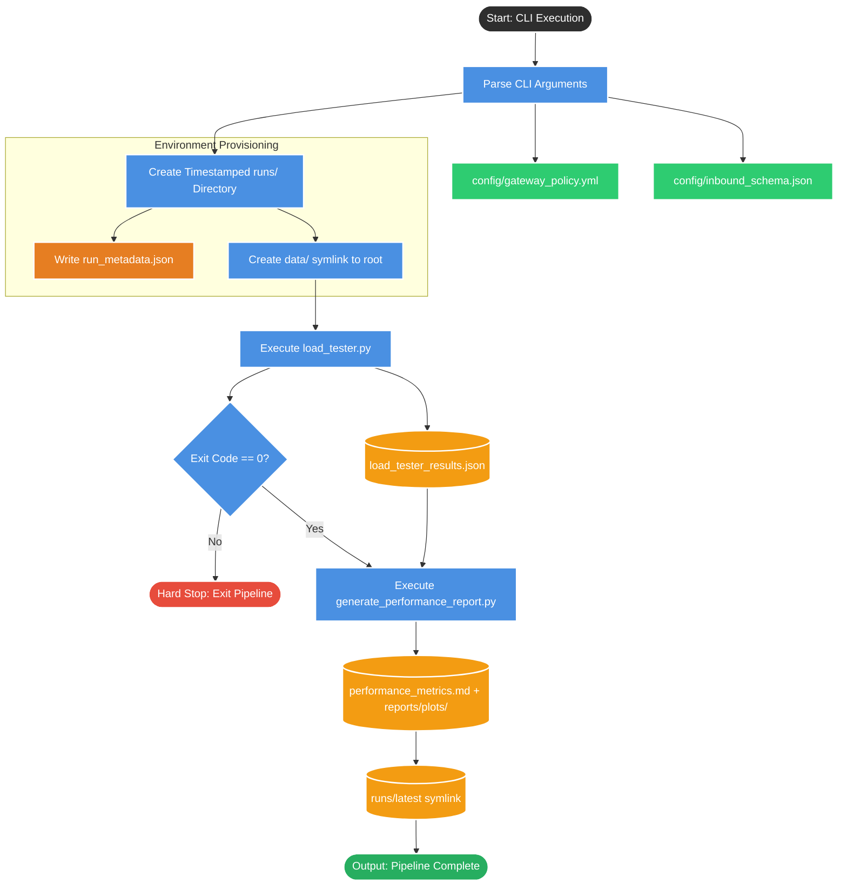

# Run_experiment.sh

## 1. System Mental Model (The Flowchart)

This flowchart visualizes the automated DevOps pipeline that sequentially executes your testing tools and organizes their outputs into an immutable historical record.

---

## 2. The Operating Manual

This wrapper script acts as the single terminal entry point to run an entire testing lifecycle. To operate it, you pass command-line arguments that the bash script dynamically forwards to the underlying Python tools.

* **`--scenario`**: The specific threat vector to simulate.
* *Options*: `approved`, `forbidden`, `quarantine`, `rate_limit`, or `mixed`.
* *Default*: `mixed`

* **`--total`** (or **`--total-requests`**): The absolute number of payloads the underlying load tester will generate.
* *Default*: `1000`

* **`--concurrency`**: The size of the simulated "swarm" firing simultaneously.
* *Default*: `100`

* **`--slo`**: The strict Service Level Objective latency threshold in milliseconds used by the reporting script to grade the test as a PASS/FAIL.
* *Default*: `50`

---

## 3. Outputs & Side Effects

When you hit enter, this script completely automates your workspace organization, producing the following artifacts:

* **The Isolated Run Directory**: It dynamically generates a timestamped folder formatted as `runs/YYYY-MM-DD/HHMMSS-<uuid>/` at the root of your project. Everything generated during this specific test execution is strictly contained here.
* **The Audit Trail (`run_metadata.json`)**: It generates a JSON file capturing the exact CLI arguments used, the precise timestamp, and a unique run ID to ensure historical tracking is accurate.
* **Artifact Routing**: It forces the `load_tester.py` to save its raw JSON output into the new run directory, and subsequently forces `generate_performance_report.py` to save the Markdown report there as well.
* **The Symlinks (Shortcuts)**:
* It creates a `data/` shortcut *inside* the run folder pointing back to your main project data so you can browse Hive-partitioned payloads without duplicating them.
* It updates a `runs/latest` shortcut at the project root to always point to the most recently completed test.

---

## 4. TPM Risk Areas

If we are embedding this wrapper script into an automated CI/CD pipeline (like GitHub Actions or Jenkins), I would raise the following issues with the DevOps team:

* **Strict Environment Coupling (`PYTHON` Path)**: The script heavily relies on the variable `PYTHON=${PYTHON:-"$ROOT/venv/bin/python"}`. It assumes a local virtual environment named `venv` exists at the project root. If this runs in a Docker container or a CI/CD runner where Python is installed globally, the script will crash immediately trying to find a non-existent `venv/bin/python` path.
* **Partial Run Zombie State**: The script uses `set -e` (which instantly kills the pipeline if a command fails). If the load tester runs perfectly but the reporting script crashes (e.g., an Out-of-Memory error), the bash script dies immediately. The `runs/latest` symlink will *not* be updated, and a partially populated run folder will be left abandoned in the directory, creating confusion for anyone reviewing the test history.