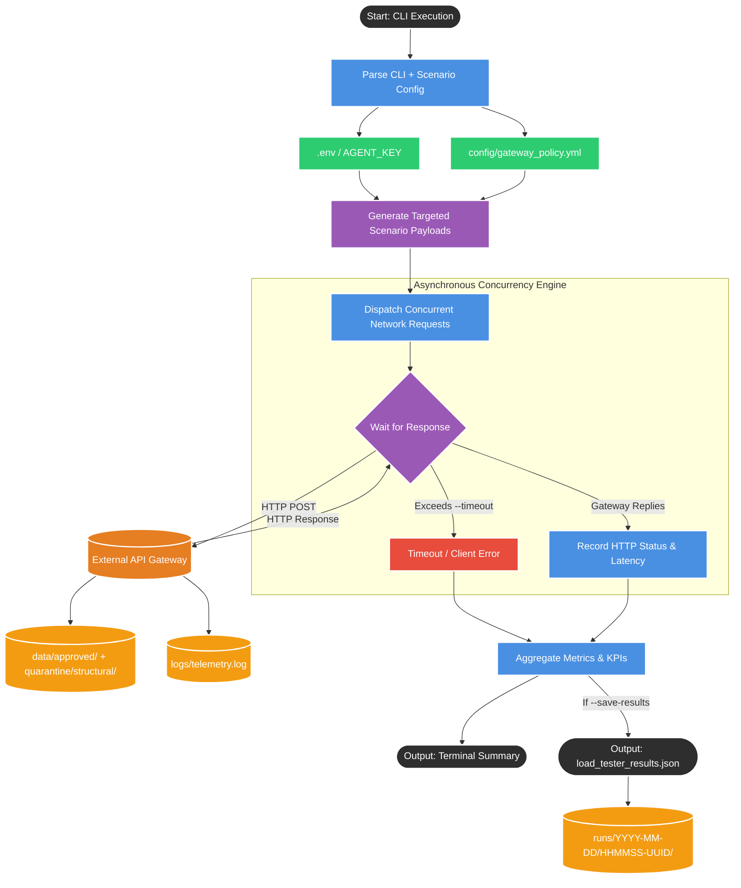
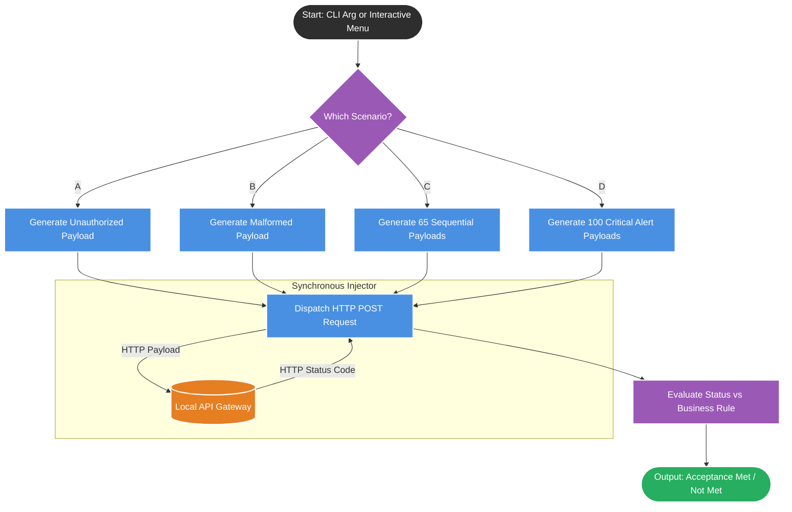
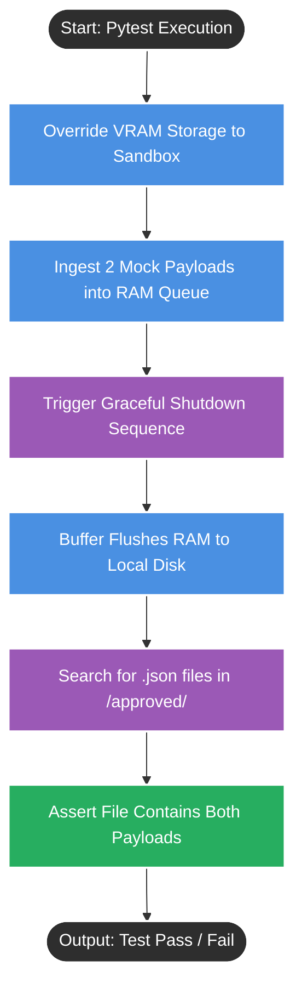
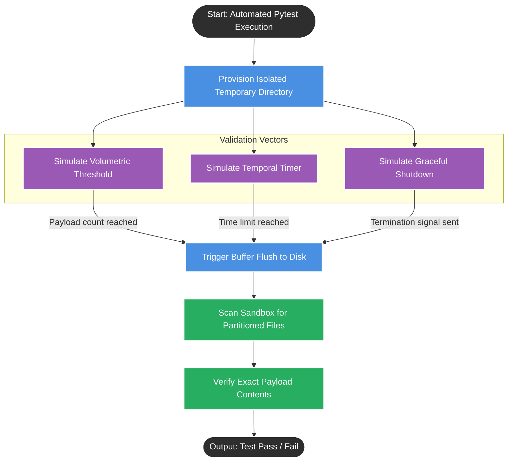
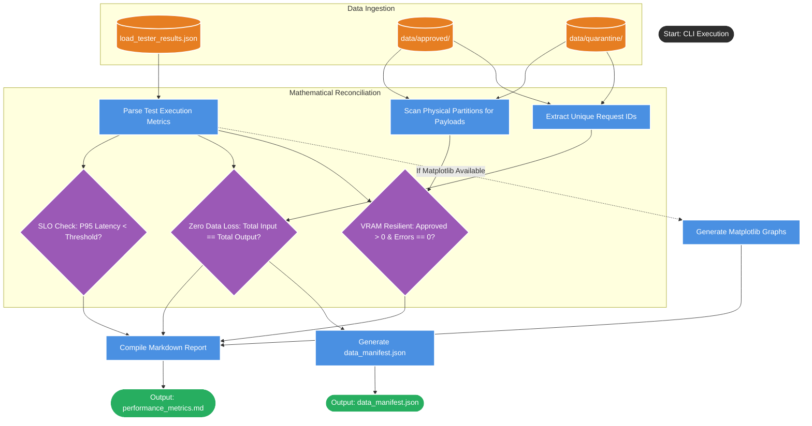

# Load Tester
## 1. System Mental Model (The Flowchart)

This load tester is a custom high-throughput stress-testing tool that functions much like enterprise frameworks such as Locust or JMeter. It is designed to violently test architectural constraints under extreme pressure by simulating a decentralized swarm of physical MedTech sensors.

---

## 2. The Operating Manual

To operate this tool, you pass command-line arguments to orchestrate the simulation. Here are the inputs required to drive it:

* **`--url`**: The target destination the tool will attack.
* *Default*: `[http://127.0.0.1:8000/ingest](http://127.0.0.1:8000/ingest)`

* **`--scenario`**: The specific threat vector or traffic pattern to simulate.
* *Options*: `approved`, `forbidden`, `quarantine`, `rate_limit`, or `mixed`.
* *Default*: `approved`

* **`--total-requests`**: The absolute number of payloads the tool will generate and send.
* *Default*: `100`

* **`--concurrency`**: The size of the simulated "swarm". This controls how many network requests are in flight at the exact same millisecond.
* *Default*: `50`

* **`--timeout`**: The strict time boundary (in seconds) the tool will wait for the API gateway to respond before marking the request as a failure.
* *Default*: `5.0`

* **`--agent-key`**: The security credential attached to the headers of the simulated traffic.
* *Default*: resolves from the `AGENT_KEY` environment variable, otherwise falls back to `demo-agent-key`

* **`--extra-payload`**: An optional escape hatch that allows you to inject custom JSON directly into the generated payloads.
* *Default*: None

* **`--save-results`** & **`--results-output`**: A toggle flag and file path dictating whether the tool should export its raw data to a file.
* *Default*: False / `load_tester_results.json`

---

## 3. Outputs & Side Effects

When the simulation completes its traffic burst, the tool acts as a stopwatch and produces the following artifacts:

* **The Terminal Report:** A human-readable summary printed directly to the screen. It aggregates the total execution time, total payloads sent, average system latency, and an exact statistical breakdown of returned HTTP status codes (e.g., 200 OK, 403 Forbidden, 429 Too Many Requests, 422 Quarantine / Validation Error).
* **The Raw JSON Export (Optional):** If the save flag is toggled, it writes a highly structured file containing the exact configuration used, execution timestamps, and a per-request ledger of latency and status codes. This raw output acts as the input for downstream Markdown reporting tools.
* **System Side Effects:** Because this tool interacts with a live server, firing thousands of valid payloads concurrently completely floods the API Gateway's Virtual VRAM buffer. This forces the gateway to autonomously flush the data to the hard drive, permanently creating the Hive-partitioned `/approved/` or `/quarantine/` directories in the project root.

---

## 4. TPM Risk Areas

If I were reviewing this architecture for a production-grade testing pipeline, here are the two bottlenecks I would ask the engineering team to address immediately:

* **The Rate Limit Math Flaw (Scenario Logic Trap):** The current code distributes the `rate_limit` traffic across 5 different `equipment_id`s (`index % 5`). The API Gateway enforces a strict 60 Requests-Per-Minute quota per ID. If you run this script with the default 100 requests, each equipment ID only receives about 20 requests. Because none of them breach the 60 RPM threshold, the gateway will incorrectly issue 100% successful 200 OK responses instead of the expected 429 Hard Drops. To properly test volumetric drops, all high-volume requests must target a single static equipment ID.
* **In-Memory Aggregation Limit:** The script stores the result of every single network request in the system's active RAM until the test completes, and only *then* summarizes or saves it to disk. If we attempt a massive soak test (e.g., 5 million requests over 12 hours), the testing tool itself will likely crash from an Out-of-Memory (OOM) exception before the server does. Results should be streamed to disk dynamically.

# Test_injector.py

## 1. System Mental Model (The Flowchart)

This tool serves as our Functional Automation Harness. It acts as a "polite" client that sends traffic sequentially to prove our business logic and routing rules work exactly as designed on the happy path.

---

## 2. The Operating Manual

Because this script is designed to replace manual typing, its execution is highly rigid. It does not accept complex configurations. Here are the inputs required to run it:

* **Execution Mode**: The tool can be run interactively (providing a menu) or immediately by passing a single letter argument in the terminal.
* **Target Scenarios**:
* **`A` (Security Test)**: Intentionally uses a broken security key to verify the Gateway instantly drops the connection.
* **`B` (Integrity Test)**: Sends structurally broken data (a string instead of a data dictionary) to test the 422 quarantine path.
* **`C` (Volumetric Test)**: Fires a sequence of 65 payloads from a single ID to verify the Gateway cuts off traffic exactly after the 60th request.
* **`D` (Life-Safety Test)**: Fires 100 payloads flagged with a critical hardware alert to prove life-safety data bypasses volumetric rate limits entirely.

* **Runtime Defaults (No CLI Overrides)**:
* **Target URL**: Locked to `[http://127.0.0.1:8000/ingest](http://127.0.0.1:8000/ingest)`.
* **Security Key**: Resolves from the `AGENT_KEY` environment variable and falls back to `demo-agent-key` for local-only development (except for Scenario A).

---

## 3. Outputs & Side Effects

This script is purely a functional trigger. When executed, it produces the following:

* **The Terminal Audit**: It acts as a UAT ledger, printing out the exact HTTP status codes it received and explicitly stating whether the Acceptance Criteria was "met" or "not met" based on the expected outcome.
* **System Side Effects**: Because it talks to a live server, firing these scenarios causes the API Gateway to mutate its internal state.
* Scenario B forces the server to physically create a Hive-partitioned `/quarantine/structural/` folder on the local hard drive to isolate the bad payload.
* Scenarios C and D force the server's tracking mechanism (Redis mock) to increment its counters in active memory.

---

## 4. TPM Risk Areas

If we intend to use this script in our enterprise CI/CD pipelines, I would raise the following issues with the engineering team:

* **Environment Drift Risk**: The injector still defaults to a local development key if the `AGENT_KEY` environment variable is not set. That is acceptable for sandbox usage, but in a staging or production deployment the key should be passed explicitly via the environment so the test does not silently drift away from the live gateway configuration.
* **False-Positive CI/CD Passing**: Even if an Acceptance Criteria fails (e.g., the server returns a 200 instead of a expected 403), the script gracefully prints "not met" and exits smoothly with a `0` success code. Automated deployment pipelines rely on non-zero exit codes to know when a test fails. As currently written, a broken gateway could pass through our deployment pipeline because the test script doesn't officially "fail".

Here is the black-box systems analysis of the automated test script.

Unlike the high-throughput chaos tools or functional interactives we reviewed previously, this is a **White-Box Unit Test**. It is specifically designed to prove internal code logic safely and rapidly without leaving leftover files in your workspace.

# Test_integration_vram.py
## 1. System Mental Model (The Flowchart)

This script tests the system's "Graceful Shutdown" resilience—proving that when the server lifecycle ends, the Virtual VRAM buffer drains any remaining approved payloads from volatile RAM to the hard drive before terminating to prevent data loss. This is a lifecycle durability step for already-approved traffic, not a re-check of the upstream security tiers.

---

## 2. The Operating Manual

This code is not meant to be executed directly by a human typing `python script.py`. It is a modular test designed for an automated runner. Here are its operational inputs:

* **Execution Trigger:** It is executed via the command line using the standard `pytest` framework (e.g., `python -m pytest tests/test_vram_batcher.py`).
* **The Sandbox Input (`tmp_path`):** The script explicitly uses a built-in pytest feature called `tmp_path`. This automatically injects a secure, temporary directory path into the function so the test doesn't write fake data to our real enterprise folders.
* **The Mock Traffic:** It injects two hardcoded dictionary payloads (`smoke-1` and `smoke-2`) directly into the buffer's memory, bypassing the API Gateway entirely to isolate the VRAM logic.

---

## 3. Outputs & Side Effects

When the test runner executes this function, it produces the following:

* **The Validation Outcome:** It provides a boolean pass/fail status back to the CI/CD pipeline, mathematically proving that the shutdown handler intercepted the termination and successfully flushed all remaining payloads to disk before allowing the server process to exit.
* **Physical File Generation:** It forces the creation of the `approved` folder and a `.json` file on the hard drive. However, because it targets `tmp_path`, these files are automatically deleted by the operating system after the test completes, leaving your primary workspace completely clean.

---

## 4. TPM Risk Areas

If this unit test is integrated into our enterprise CI/CD deployment pipeline, here are the two risks I would flag to the engineering team:

* **Global State Mutation (The Flaky Test Risk):** The script dynamically overrides the live system's `gateway.vram_buffer.storage_root` variable. If our CI/CD pipeline attempts to run our unit tests in parallel to speed up build times (using a library like `pytest-xdist`), this test will cause race conditions. Multiple tests running simultaneously will continually overwrite this global storage path, causing tests to fail randomly and unpredictably.
* **Strict Batching Assumption:** The final assertion code expects both the `smoke-1` and `smoke-2` payloads to exist inside a *single* written file. If we ever update our storage routing logic to split data dynamically (e.g., saving different `equipment_id`s into different files), this test will immediately break even if the data was successfully saved.

# Test_virtual_vram_batcher

## 1. System Mental Model (The Flowchart)

This script is an automated unit test suite designed for the Virtual VRAM Buffer, it acts as a "White-Box" test meant to mathematically verify internal code logic safely and rapidly without leaving leftover files in your workspace.It specifically tests three distinct enterprise triggers to ensure the asynchronous memory queue correctly handles dynamic batching without data loss.

---

## 2. The Operating Manual

This code is not meant to be executed directly by a human typing `python script.py`. It is executed via an automated test runner. Here are its operational inputs:

* **Execution Command:** It is triggered using the standard command `python -m pytest tests/test_virtual_vram_batcher.py`.
* **The Sandbox Input (`tmp_path`):** The script explicitly uses a built-in feature that creates a completely isolated, temporary directory deep inside your computer's system files specifically for that single test run.
* **Simulated Inputs:**
* **Volumetric Trigger Test:** Injects exactly 2 payloads to prove the buffer immediately flushes the data to the correct Hive-partitioned directory when full.
* **Temporal Trigger Test:** Sets a timer for 0.05 seconds to prove an active background timer forces a bulk flush to prevent stale data.
* **Resilience Trigger Test:** Injects a payload and immediately forces a shutdown to ensure any remaining items sitting in volatile RAM are safely flushed to disk so there is zero data loss.

---

## 3. Outputs & Side Effects

When the automated pipeline runs this suite, it produces the following:

* **The CI/CD Ledger:** It outputs a clean "PASSED" status back to the terminal. By default, the test runner suppresses standard output (like diagnostic print logs) unless a test fails.
* **Ghost Folder Generation:** It physically generates the Hive-partitioned `/approved/` directories and writes `.json` files to the hard drive, but it does so inside the temporary sandbox.
* **Automatic Clean-up:** Once the test finishes, the runner handles that space and automatically deletes it. It intentionally does not pollute your project root directory or your `src/` folder with leftover test files.

---

## 4. TPM Risk Areas

If we intend to run this in a heavily utilized CI/CD pipeline, I would raise the following two risks to the engineering team:

* **Hardcoded Sleep Timers (Flaky Test Risk):** The temporal test relies on the script pausing for exactly 0.12 seconds, assuming the background buffer will finish its flush within that exact micro-window. If our enterprise CI/CD servers are under heavy load and CPU cycles are delayed, the test will check for the file *before* the VRAM finishes writing it. This will cause the test to falsely fail, breaking our deployment pipeline intermittently.
* **Strict Single-File Assertions:** The tests assert that exactly one file (`len(files) == 1`) is created per test. If the engineering team later updates the batching logic to split traffic into multiple files for performance optimization, these unit tests will instantly fail—even if the system is working perfectly.

# Generate_performance_report.py

This script serves as the **Presenter** in your testing architecture. It explicitly enforces the enterprise principle of **Decoupling** by separating the tool that generates the chaos (the load tester) from the tool that calculates the math and visualizes the results.

### 1. System Mental Model (The Flowchart)

This flowchart visualizes how the script ingests distributed test artifacts, reconciles them for data loss, and synthesizes the final compliance deliverables.

---

### 2. The Operating Manual

This script belongs in your `scripts/` folder alongside your other developer tools and is executed after your load test completes. It requires the following inputs to run:

* **`--input`**: The file path to the raw JSON output generated by the load tester.
* *Default*: Looks for `load_tester_results.json` in the current working directory.

* **`--data-root`**: The top-level directory where the system writes its Hive-partitioned physical data payloads.
* *Default*: `./data`

* **`--output`**: The destination path and filename for the final Markdown report.
* *Default*: `./reports/performance_metrics.md`

* **`--slo`**: The strict Service Level Objective (SLO) threshold in milliseconds that the P95 latency must stay below to pass the test.
* *Default*: `50.0` ms

---

### 3. Outputs & Side Effects

When the script finishes executing, it produces a suite of distinct artifacts to satisfy both human stakeholders and automated CI/CD pipelines:

* **The Markdown Report (`performance_metrics.md`)**: A human-readable profiling report. It contains the mathematical proof that the system met its P95 Latency SLO, verification of zero data loss, a status code breakdown, and an assessment of VRAM backpressure resilience.
* **The Digital Shipping Receipt (`data_manifest.json`)**: A lightweight, machine-readable JSON file output alongside the report. It tracks the exact counts of approved and quarantined payloads and serves as a reproducible reconciliation artifact for the run.
* **Visualizations (`plots/*.png`)**: If the `matplotlib` library is installed on the host machine, the script generates two PNG graphs (a Latency Histogram and a Status Code Bar Chart) and embeds them directly into the Markdown report.
* **System Side Effects**: None. This script is strictly read-only. It scans data directories and parses JSON files without mutating or deleting any underlying system states.

---

### 4. TPM Risk Areas

If integrating this script into a production CI/CD pipeline or utilizing it for massive soak tests, I would highlight the following constraints to the engineering team:

* **In-Memory ID Extraction (OOM Risk):** The `extract_request_ids()` function recursively opens and loads every single `.json` file inside the `data/` directories into memory to scan for `_request_id` keys. If you run a massive 500,000-payload load test, this reporting script could trigger an Out-of-Memory (OOM) crash on the CI/CD runner during the audit phase.
* **Dependency on Upstream Data Shapes:** The zero-data-loss reconciliation math relies heavily on finding specific keys (`_request_id`, `request_id`, `_req_id`) inside the physical payload files. If the firmware team changes the payload shape or the ETL pipeline strips these keys earlier than expected, the mathematical reconciliation will falsely report a catastrophic "Data Loss" failure.

