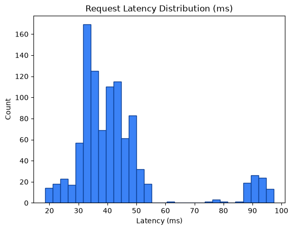

# Performance Metrics Report

Generated: 2026-08-17T03:06:33.192701Z

## 1. SLO Latency Enforcement

- Measured requests: **1000**
- Latency (count): 1000
- Average latency: **43.06 ms**
- Min / P50 / P90 / P95 / Max: 18.47 / 39.74 / 53.02 / 90.61 / 97.28 ms
- SLO threshold: **50.0 ms**
- Result: **FAIL** — P95 latency 90.6100000065635ms >= 50.0ms (FAIL)




## 2. Zero Data Loss Verification

- Total input payloads: **1000**
- Approved (data/approved) files/item-count: **0**
- Quarantined (data/quarantine/structural) files/item-count: **0**
- Approved unique request_ids found: **0**
- Quarantined unique request_ids found: **0**
- HTTP 429 dropped: **0**
- HTTP 403 dropped: **1000**

Mathematical reconciliation:
```text
Total Input = Approved + Quarantined + 429_drops + 403_drops
1000 = 0 + 0 + 0 + 1000
```
- Zero data loss verification: **PASS**
- Input request_ids observed: **1000**
- Matched approved request_ids: **0**
- Matched quarantined request_ids: **0**
## 3. VRAM Backpressure Resilience

- Approved files written (data/approved): **0**
- Quarantine files written (data/quarantine/structural): **0**
- Runtime errors during requests: **0**
- VRAM buffer: **Potential issues detected** — verify runtime logs for memory allocation errors or dropped/errored requests.

## 4. Status Code Breakdown

| HTTP Status | Count | % of Total |
|---:|---:|---:|
| 403 | 1000 | 100.00% |