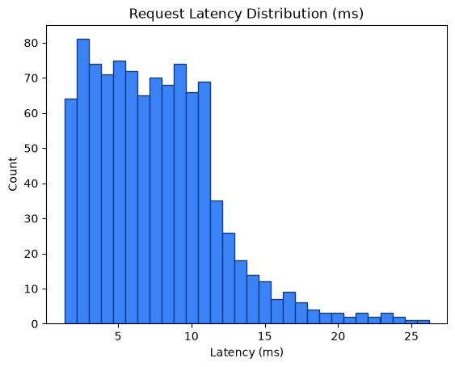

# Performance Metrics Report

Generated: 2026-08-17T03:11:06.939014Z

## 1. SLO Latency Enforcement

- Measured requests: **1000**
- Latency (count): 1000
- Average latency: **7.54 ms**
- Min / P50 / P90 / P95 / Max: 1.34 / 7.11 / 12.61 / 15.02 / 26.19 ms
- SLO threshold: **50.0 ms**
- Result: **PASS** — P95 latency 15.02ms < 50.0ms (PASS)



## 2. Zero Data Loss Verification

- Total input payloads: **1000**
- Approved (data/approved) files/item-count: **0**
- Quarantined (data/quarantine/structural) files/item-count: **0**
- Approved unique request_ids found: **0**
- Quarantined unique request_ids found: **0**
- HTTP 429 dropped: **0**
- HTTP 403 dropped: **0**

Mathematical reconciliation:
```text
Total Input = Approved + Quarantined + 429_drops + 403_drops
1000 = 0 + 0 + 0 + 0
```
- Zero data loss verification: **FAIL**
- Input request_ids observed: **1000**
- Matched approved request_ids: **0**
- Matched quarantined request_ids: **0**
## 3. VRAM Backpressure Resilience

- Approved files written (data/approved): **0**
- Quarantine files written (data/quarantine/structural): **0**
- Runtime errors during requests: **1000**
- VRAM buffer: **Potential issues detected** — verify runtime logs for memory allocation errors or dropped/errored requests.

## 4. Status Code Breakdown

| HTTP Status | Count | % of Total |
|---:|---:|---:|

Errors encountered (network/timeouts):

- Cannot connect to host 127.0.0.1:8000 ssl:default [Connect call failed ('127.0.0.1', 8000)]: 1000