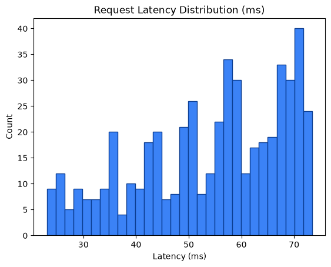
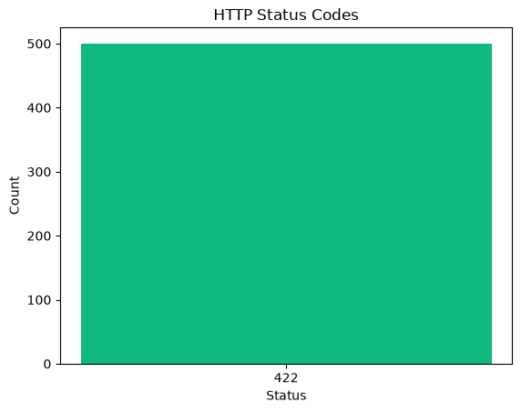

# Performance Metrics Report

Generated: 2026-08-24T20:22:27.029715Z

## 1. SLO Latency Enforcement

- Measured requests: **500**
- Latency (count): 500
- Average latency: **54.18 ms**
- Min / P50 / P90 / P95 / Max: 23.07 / 57.04 / 70.81 / 71.65 / 73.40 ms
- SLO threshold: **50.0 ms**
- Result: **FAIL** — P95 latency 71.65345799876377ms >= 50.0ms (FAIL)





## 2. Zero Data Loss Verification

- Total input payloads: **500**
- Approved (data/approved) files/item-count: **1**
- Quarantined (data/quarantine/structural) files/item-count: **501**
- Approved unique request_ids found: **0**
- Quarantined unique request_ids found: **500**
- HTTP 429 dropped: **0**
- HTTP 403 dropped: **0**

Mathematical reconciliation:
```text
Total Input = Approved + Quarantined + 429_drops + 403_drops
500 = 1 + 501 + 0 + 0
```
- Zero data loss verification: **PASS**
- Input request_ids observed: **500**
- Matched approved request_ids: **0**
- Matched quarantined request_ids: **500**
## 3. VRAM Backpressure Resilience

- Approved files written (data/approved): **1**
- Quarantine files written (data/quarantine/structural): **501**
- Runtime errors during requests: **0**
- VRAM buffer: **Appears resilient** — approved payloads were flushed to disk and no request errors observed.

## 4. Status Code Breakdown

| HTTP Status | Count | % of Total |
|---:|---:|---:|
| 422 | 500 | 100.00% |