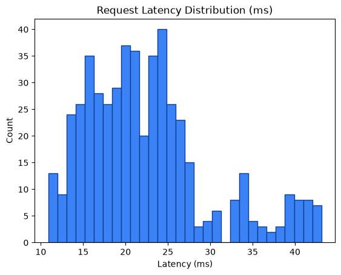
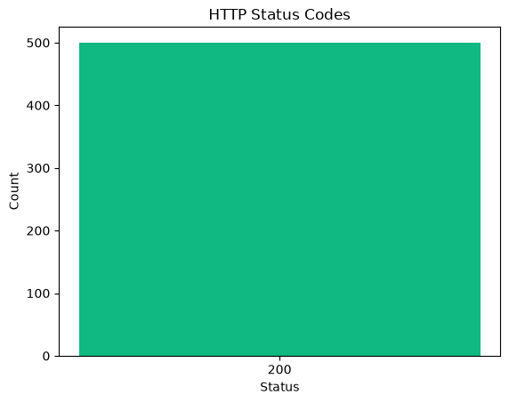

# Performance Metrics Report

Generated: 2026-08-24T20:50:11.352478Z

## 1. SLO Latency Enforcement

- Measured requests: **500**
- Latency (count): 500
- Average latency: **22.52 ms**
- Min / P50 / P90 / P95 / Max: 10.88 / 21.24 / 34.08 / 39.44 / 43.12 ms
- SLO threshold: **50.0 ms**
- Result: **PASS** — P95 latency 39.44ms < 50.0ms (PASS)





## 2. Zero Data Loss Verification

- Total input payloads: **500**
- Approved (data/approved) files/item-count: **501**
- Quarantined (data/quarantine/structural) files/item-count: **1001**
- Approved unique request_ids found: **0**
- Quarantined unique request_ids found: **1000**
- HTTP 429 dropped: **0**
- HTTP 403 dropped: **0**

Mathematical reconciliation:
```text
Total Input = Approved + Quarantined + 429_drops + 403_drops
500 = 501 + 1001 + 0 + 0
```
- Zero data loss verification: **FAIL**
- Input request_ids observed: **500**
- Matched approved request_ids: **0**
- Matched quarantined request_ids: **0**

Unmatched input request_ids (samples):
- 33a8384fac9d4908b878b42fc6714579
- ea30bba06dbf46fbbfeeae5e957f7267
- 80cca5660b1a4dcfb68b13e3af5d9c6c
- 30db89dec9974c658ca464ecd6950d5a
- 98c12260359e4ae48a741a727747440f
- 3292db512bc24ae188a343a352657bd1
- f4f75cbc49144974bbfc938276b63b78
- a4167f9ea9a443488b9905c49be907a1
- 922e826816374db294bed2cce98a93e6
- 7f3f8fe5164d47e49bdc7bab2cee29c3
- 6d4cc6f7250f4925bcc07be7c1fd6fd7
- 8c8dd72100494361b71125c10c6ee5fb
- 51a5158a23194c7382e539c4e0d06acf
- a027dd0a1f6747f7a2e888d7a6e97f44
- 6d125098f14c4264a08ee2ea7aeb340b
- 88fbb434cf5948e1930b38f2a3cce48b
- 08e993147d204e6ca2a9062482a01cf9
- 18929d5f7b124340b36eca38d5443529
- fcd8014abfe04548874c5bc7f1bb7996
- 0f190ef5f5e946abbd522fd51933ff78

## 3. VRAM Backpressure Resilience

- Approved files written (data/approved): **501**
- Quarantine files written (data/quarantine/structural): **1001**
- Runtime errors during requests: **0**
- VRAM buffer: **Appears resilient** — approved payloads were flushed to disk and no request errors observed.

## 4. Status Code Breakdown

| HTTP Status | Count | % of Total |
|---:|---:|---:|
| 200 | 500 | 100.00% |