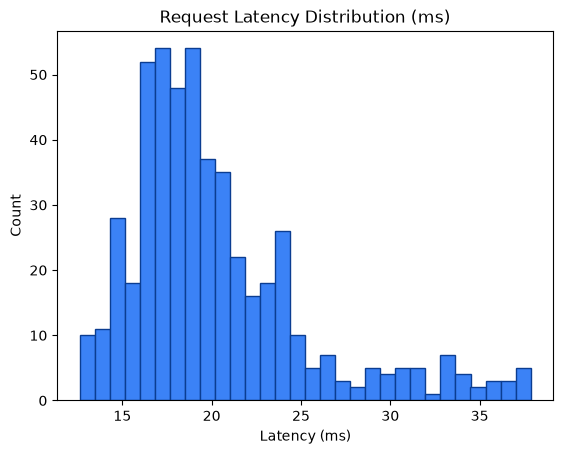

# Performance Metrics Report

Generated: 2026-08-24T20:59:27.791950Z

## 1. SLO Latency Enforcement

- Measured requests: **500**
- Latency (count): 500
- Average latency: **20.25 ms**
- Min / P50 / P90 / P95 / Max: 12.61 / 19.02 / 26.55 / 31.93 / 37.85 ms
- SLO threshold: **50.0 ms**
- Result: **PASS** — P95 latency 31.93ms < 50.0ms (PASS)




## 2. Zero Data Loss Verification

- Total input payloads: **500**
- Approved (data/approved) files/item-count: **501**
- Quarantined (data/quarantine/structural) files/item-count: **1001**
- Approved unique request_ids found: **0**
- Quarantined unique request_ids found: **1000**
- HTTP 429 dropped: **0**
- HTTP 403 dropped: **0**

Mathematical reconciliation:
```text
Total Input = Approved + Quarantined + 429_drops + 403_drops
500 = 501 + 1001 + 0 + 0
```
- Zero data loss verification: **FAIL**
- Input request_ids observed: **500**
- Matched approved request_ids: **0**
- Matched quarantined request_ids: **0**

Unmatched input request_ids (samples):
- 08d8354badd24c359662c724320d522a
- e132e5ec9888486787e98c07c8ca3543
- c3186eb896a24c898f00c46b0bcca434
- bfade102a6b649d3960d4451004e0e20
- 7a3ea62adab648c2a7775c106a8ddfce
- 8bdb2574faa8458cbd51fc7868f6c5a4
- 774d8c5670c04201a503ef75b8f113cf
- 73645397015d49f7ae1f2a142581d4be
- 3ff00af9a6904df689ba42dbe92c0020
- 1d1b41c03c544b8fa97eaa36872089a5
- f77bb93e6c274d79b6352303fe0820f0
- 3073c10a6f6c45fabef958fa6ee8e7c2
- 304f0a9f05f940e4a9990284e200d259
- 6a8a6c04d5a44d8d8d8a6ed2394ac399
- b17bb97d2d894567991dc60a9f139084
- cf9707dfb6be436ca3d274cb80d24d3f
- b2ae97509fbb489382baefb04ca16cbc
- b685b2f2174148fcae756aee81021892
- b6a94109cfe948878aae05f3e9460bd0
- e249cd65f2834abaa658288b33654a0e

## 3. VRAM Backpressure Resilience

- Approved files written (data/approved): **501**
- Quarantine files written (data/quarantine/structural): **1001**
- Runtime errors during requests: **0**
- VRAM buffer: **Appears resilient** — approved payloads were flushed to disk and no request errors observed.

## 4. Status Code Breakdown

| HTTP Status | Count | % of Total |
|---:|---:|---:|
| 200 | 500 | 100.00% |