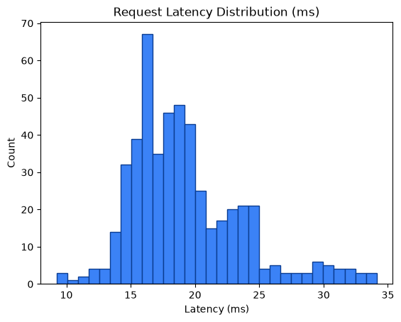

# Performance Metrics Report

Generated: 2026-08-24T21:01:56.606879Z

## 1. SLO Latency Enforcement

- Measured requests: **500**
- Latency (count): 500
- Average latency: **19.26 ms**
- Min / P50 / P90 / P95 / Max: 9.24 / 18.40 / 24.73 / 28.97 / 34.12 ms
- SLO threshold: **50.0 ms**
- Result: **PASS** — P95 latency 28.97ms < 50.0ms (PASS)




## 2. Zero Data Loss Verification

- Total input payloads: **500**
- Approved (data/approved) files/item-count: **501**
- Quarantined (data/quarantine/structural) files/item-count: **1001**
- Approved unique request_ids found: **0**
- Quarantined unique request_ids found: **1000**
- HTTP 429 dropped: **0**
- HTTP 403 dropped: **0**

Mathematical reconciliation:
```text
Total Input = Approved + Quarantined + 429_drops + 403_drops
500 = 501 + 1001 + 0 + 0
```
- Zero data loss verification: **FAIL**
- Input request_ids observed: **500**
- Matched approved request_ids: **0**
- Matched quarantined request_ids: **0**

Unmatched input request_ids (samples):
- 57456a038cdb41498e9b8e02c3d1f1c8
- 4bc0abb6f0a64ab3811ea61697f240b5
- f63529f3fd4c429e91e2ecea44618109
- 6316d9b89dc147b8b19a691642922087
- c7351655f96e4d50b6b06e377c38523d
- 4ba421a1d94442198328764e7d4bccee
- 2abf55050a1941dfb0b01240c5a2ccaf
- 46013e1097894e46b32a55878b41d4fd
- cfdc4a7df46c4502ab3f09cf97e180a4
- 479cbf9e806d4d4991933e5ddfc44d15
- f140aee08fb74161b5fe74b89c936bf9
- fe48260ada0742a299faae184cc0d3ce
- a5f82b7aca1e4ae1a1b1a21816a39a11
- d221877abf6b4503917d00b6b84ca8ae
- 517e9d27e1bc4c39a8cd4c9d009c0d62
- b48e0ff42beb49c499c35b8b530ab5ad
- fd6542b1379a4fe19e5f5bcfc702b532
- be43863133ec47e38543a65edb717c54
- 74e8289a16ce46a484d42f46d4d0006f
- d2fa49e3ddd344e69205de488e065f90

## 3. VRAM Backpressure Resilience

- Approved files written (data/approved): **501**
- Quarantine files written (data/quarantine/structural): **1001**
- Runtime errors during requests: **0**
- VRAM buffer: **Appears resilient** — approved payloads were flushed to disk and no request errors observed.

## 4. Status Code Breakdown

| HTTP Status | Count | % of Total |
|---:|---:|---:|
| 200 | 500 | 100.00% |