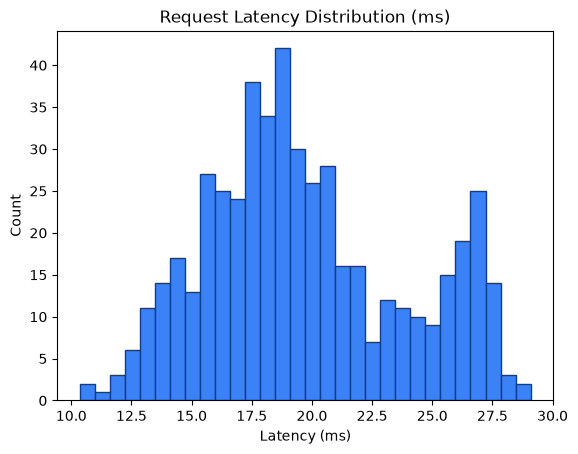

# Performance Metrics Report

Generated: 2026-08-24T21:02:45.400972Z

## 1. SLO Latency Enforcement

- Measured requests: **500**
- Latency (count): 500
- Average latency: **19.70 ms**
- Min / P50 / P90 / P95 / Max: 10.35 / 18.98 / 26.34 / 27.02 / 29.09 ms
- SLO threshold: **50.0 ms**
- Result: **PASS** — P95 latency 27.02ms < 50.0ms (PASS)




## 2. Zero Data Loss Verification

- Total input payloads: **500**
- Approved (data/approved) files/item-count: **1001**
- Quarantined (data/quarantine/structural) files/item-count: **1001**
- Approved unique request_ids found: **0**
- Quarantined unique request_ids found: **1000**
- HTTP 429 dropped: **0**
- HTTP 403 dropped: **0**

Mathematical reconciliation:
```text
Total Input = Approved + Quarantined + 429_drops + 403_drops
500 = 1001 + 1001 + 0 + 0
```
- Zero data loss verification: **FAIL**
- Input request_ids observed: **500**
- Matched approved request_ids: **0**
- Matched quarantined request_ids: **0**

Unmatched input request_ids (samples):
- 8e7f693106b344e5823b97bcab8e1379
- f06b36545d9c49dca1b0f99198cbbd24
- 5b6f85378bd141d0a0966f1a9f8ddb64
- b0673e836eb348e1a33ab7b8200a7c4c
- d31f1772187c41b09921122395b53e2a
- ed045ea5dd7f4b3dadcba8c54bde288d
- fb7b41865a6149778338e578a7d7a1cc
- c271bf63be904d279129e78d62cef188
- c441b1914a3547c2abf62919e7e1aeec
- 1a2c0c74fedc4879ac2cc2e6abd769dc
- fdd9c168aa524b69a9b9e447784740bf
- a87d627f484e4217a48d3d9150afddc2
- 6331f198f7134d2c9d76ad96a1c3c181
- a6ea645001324d0492c3280b2354c2fb
- a13566c3565746eab4f86c8f2aef353d
- 8d7bf430b0e942af97afee6193e1d453
- f2735727d7684f13a1dc177edb9e18cd
- 20100df7ef3c4c0eb7abb5bdd17daa9c
- 253637a08a9a47f7974a35c49b9cc393
- 89a13dfed3e84ae2a8edadb662a75b4c

## 3. VRAM Backpressure Resilience

- Approved files written (data/approved): **1001**
- Quarantine files written (data/quarantine/structural): **1001**
- Runtime errors during requests: **0**
- VRAM buffer: **Appears resilient** — approved payloads were flushed to disk and no request errors observed.

## 4. Status Code Breakdown

| HTTP Status | Count | % of Total |
|---:|---:|---:|
| 200 | 500 | 100.00% |