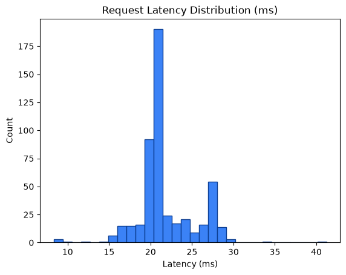

# Performance Metrics Report

Generated: 2026-08-24T21:06:07.348076Z

## 1. SLO Latency Enforcement

- Measured requests: **500**
- Latency (count): 500
- Average latency: **21.82 ms**
- Min / P50 / P90 / P95 / Max: 8.32 / 20.92 / 27.51 / 27.91 / 41.21 ms
- SLO threshold: **50.0 ms**
- Result: **PASS** — P95 latency 27.91ms < 50.0ms (PASS)




## 2. Zero Data Loss Verification

- Total input payloads: **500**
- Approved (data/approved) files/item-count: **1501**
- Quarantined (data/quarantine/structural) files/item-count: **1001**
- Approved unique request_ids found: **0**
- Quarantined unique request_ids found: **1000**
- HTTP 429 dropped: **0**
- HTTP 403 dropped: **0**

Mathematical reconciliation:
```text
Total Input = Approved + Quarantined + 429_drops + 403_drops
500 = 1501 + 1001 + 0 + 0
```
- Zero data loss verification: **FAIL**
- Input request_ids observed: **500**
- Matched approved request_ids: **0**
- Matched quarantined request_ids: **0**

Unmatched input request_ids (samples):
- 69b9f256921e4c83b63501041b94ca98
- bbc973a2a3e14264b1b23f8f882995e9
- 7d87b60bfc334bb0992f66e1dec20414
- 6dc866e290264a1a9237e0ca3d7e67b1
- b3643597e37f46418a02e56715d798a3
- 00d8c4587b4946679dd14f0eb8b4c353
- dfc34bee7cbd405ba0484bb607926dfe
- a3419f819d1c4e83ac9767baf894af3c
- 9f6d365adedb4606a193428f6307dd62
- 1766c66186c642babd513d7665625e5a
- 556da830a06844fc8fba5d44cd1865f5
- fa8476c39ceb4590b94e64f1587cb6b1
- 312e9223f8334493b060edd727ba3c40
- c595c85f391546a4bb298424d6a7e573
- a21b0820c70046439190b7c2c16ea1d5
- 29b29b9468e64ce2bb13c1ad6cc86e42
- 92697825771840abb9101b9e9106b6d2
- 698e8beec21b42f19555427c4c5e24ed
- a3d8930f66b04afda62e557a47fe5cbc
- 50df92ccffaa4bd5bd7d05b5857dfd94

## 3. VRAM Backpressure Resilience

- Approved files written (data/approved): **1501**
- Quarantine files written (data/quarantine/structural): **1001**
- Runtime errors during requests: **0**
- VRAM buffer: **Appears resilient** — approved payloads were flushed to disk and no request errors observed.

## 4. Status Code Breakdown

| HTTP Status | Count | % of Total |
|---:|---:|---:|
| 200 | 500 | 100.00% |